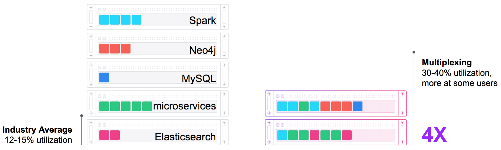
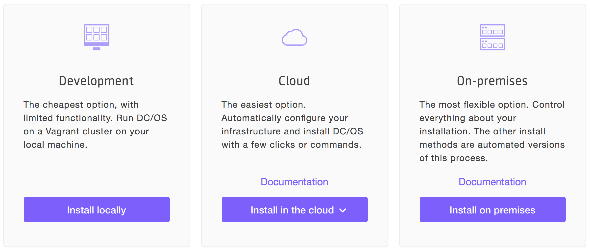
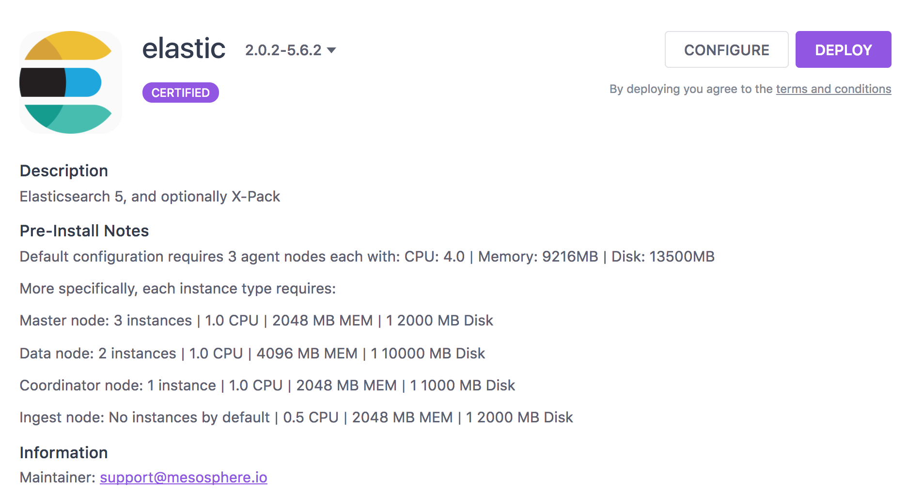

# Elasticsearch as a service on top of Apache Mesos and DC/OS

This is designed for a series of conference talks. You can find anything you need to know about DC/OS or this demo in this document or the outgoing links. This is a rather complex demo, so grab your favorit beer and enjoy 🍺


## Abstract
You are a bigger company and want to offer a self service solution for your employees to start and stop data stores on demand? Or are deploying highly dynamically applications and want the freedom to orchestrate your data services like Elasticsearch besides the rest of your architecture to profit from scaling effects? Especially talking about cluster resource utilization, various workloads or failures are challenges for the modern datacenter. To minimize these problems and maximize your cluster utilization, Apache Mesos and DC/OS, the datacenter operating system, helps you to operate huge clusters and operate your service architecture.
In this session we will see the motivation why big users operate Apache Mesos and how easy it is to implement a Elasticsearch as a service solution on top of it.


## General problems of current data center layouts
Most current data centers are architectured to be statically partitioned. This means that you have different subclusters for each part of your system. Let's say your data center has 30 nodes. You would typically slice these 30 nodes into smaller parts and assign applications to dedicated nodes. This has a couple of disadvantages. You need to optimize each subcluster against load peaks and, if nodes crash during those peaks, you are not able to shift applications to other nodes dynamically. On top of that, you're using resources inefficiently.

Resource utilization in typical industry clusters show average CPU utilization around 15% with this classic approach. Would'nt it be cool to be able to shift applications dynamically between nodes, be more flexible against failure and load peaks, and save money?



In this demo, we will increase cluster utilization by operating the Java service architecture together with all data applications on the same DC/OS cluster. Running all those different kind of application on the same cluster brings a couple of advantages. Your cluster has one big pool of resources and you are able to start applications on free resources everywhere in the cluster.

- In case of failure, your application will be dynamically restarted somewhere else in the cluster.
- Different applications usually have load peaks at different times of the day and they nicely complement each other. If you don’t partition this pool statically, you don’t need to optimize each part individually and reserve more resource than you need.


## Operating data applications in a containerized world
Orchestrating stateless applications in a containerized world is fairly simple. If you need to scale up or down, you just start or stop applications. If an application terminates, you can just restart it somewhere else. But what about operating data applications, like a traditional database or a distributed one? I would bet that you care about your data and where a replacement application is started for example.

In general, there are three different kinds of applications.


1. Stateless applications, like `nginx`, `spring boot` or `node` applications. They usually don't hold business-relevant data, so we usually don't care where replacement applications are scheduled or if we get the data back if an application crashes. For sure, this kind of applications produces logs, but we will take care of those separately. In Mesos, you can configure a default sandbox for those applications. You can use local disk, but, if the container crashes, this data is gone.

2. Stateful applications, traditional databases without cluster support, for example `MySQL`. They hold business-relevant data and we usually care a lot about what happens to this data if an application crashes. Because these applications don't support replication on their own, you must use backups and external storage to save data. If you really want to have a smooth fail-over strategy, you would usually pick an external storage option for those kind of tasks. This option has poor performance for write requests, but survives node failures. In Mesos, you can consume external storage, such as Amazon EBS.

3. But what if you are operating a database that was designed for distributed systems, like `Elasticsearch`, `Cassandra`, or similar data stores? They hold business-relevant data and provide a replication layer within the database. It would wasteful to use a distributed storage layer if the application is able to solve this problem on its own. In Mesos, you can use local persistent volumes. With this feature, it is possible to label a dedicated space on the local disk and, if the application terminates, the replacement application can be re-scheduled to the exact same data again. It doesn't matter if the application crashed because of an error, or if this was a planned maintenance or update. The already-used data can be re-used and the application can decide if it wants to re-use the data and only replicate the last few minutes or if a full replication is needed.


## Prerequisits
If you are totally new to [DC/OS](https://dcos.io/) or container orchestration in general, I would recommend you to visit our website and check the [documentation](https://dcos.io/docs/1.10/) section.

If you don't want to read documentation and a more entertaining (Monkey Island™) introduction, I am inviting you to watch this youbube video 👇❤️

[](https://www.youtube.com/watch?v=u2mpN2GxfVY)


## Get this demo working on DC/OS
- You need a running DC/OS cluster to run this demo
- You have multiple options to spin up a DC/OS cluster
	- Go to https://dcos.io/ and to walk through the possibilities or browse the docs
	- Go to https://github.com/dcos/dcos-vagrant if you want to play around on your local box

Please check this page 👇
[](https://dcos.io/install/)


### 1. Install management application

Simply run the following command to deploy our management application on a running DC/OS cluster:

```
dcos marathon group add web-app/marathon-configuration.json
```

### Scala management application and Elasticsearch as data store
Each application has an identifier followed by resource limitations. Our database application is allowed to consume 1 CPU and 1GB of memory.

We want to start one database instance and we want to use the same Docker images again as we used for Docker Compose. But now we need to configure a network option because we are dealing with a real distributed system and not a local sandbox. In this example, you see two [virtual IP](https://docs.mesosphere.com/1.10/networking/load-balancing-vips/) configurations. One with a name-based pattern and one with an IP-based pattern. With this configuration, all traffic on this name-port combination is routed to our database application.

Our Scala application has a dependency to Elasticsearch as data store, so it is deployed after Elasticsearch is marked as healthy. This service also has resource limitations, but we want to start two instances of this service. We also have a health check configured for the Scala service.

The health check specifies that the `/health` endpoint will be checked every 2 seconds after an initial grace period of 10 seconds if it returns a `HTTP 2xx`. If this check fails 10 times in a row, this service will be replaced with another one.

To expose our application to the outside, we need to add a network configuration. Because we added a `labels` section for our HAproxy later in the configuration, we can use a random host port in this section.

To connect this Java service to the database, we need to adjust the environment variables. In this example we are using the name-based VIP pattern, so we need to use this discovery name: `elasticsearch.marathon.l4lb.thisdcos.directory`. See the [docs](https://docs.mesosphere.com/1.10/networking/dns-overview/) for more information.

Last but not least, we added configuration for rolling upgrades. During an upgrade, we want a maximum overcapacity of 15% and a minimum health capacity of 85%. Image you have 20 services running. A rolling upgrade would be like, `start 3 new ones, wait for them to become healthy, then stop old ones`. If you don't like rolling upgrades, you can use blue/green or canary upgrades as well. See the [docs](https://docs.mesosphere.com/1.8/usage/service-discovery/load-balancing-vips/) for more information.


#### Elasticsearch, Logstash, Kibana
Ok, let's start with Elasticsearch and the three main new configuration options here. First, elasticsearch exposes two [virtual IPs](https://docs.mesosphere.com/1.10/networking/load-balancing-vips/). `elasticsearch:9200` is used by Logstash and Kibana. `elasticsearch:9300` is used by the scala application to store data.

```
"portMappings":[
  {
     "hostPort":0,
     "containerPort":9200,
     "protocol":"tcp",
     "labels":{
        "VIP_0":"elasticsearch:9200"
     }
  },
  {
     "hostPort":0,
     "containerPort":9300,
     "protocol":"tcp",
     "labels":{
        "VIP_0":"elasticsearch:9300"
     }
  }
]
```


Elasticsearch is a distributed database. As discussed earlier, you don't need distributed storage for a distributed database, because you would waste a lot of performance when you have replication on application layer and on storage layer. But on the other side you don't want to loose all your data, when you restart Elasticsearch. In DC/OS you have the option to use [local persistent volumes](http://mesosphere.github.io/marathon/docs/persistent-volumes.html). They allow you to label space on the local disk. If an instance is shut down, due to failure or maintenance, DC/OS is waiting to see this data again and is able to restart the replication instance on the exact same data again. In best case this prevent Elasticsearch from a full replication and leads to a smaller replication for only the last couple of minutes.

```
"volumes": [
   {
     "containerPath":"esdata",
     "mode":"RW",
     "persistent": {
       "type":"root",
       "size":5000
     }
   },
   {
     "containerPath": "/usr/share/elasticsearch/data",
     "hostPath": "esdata",
     "mode": "RW"
   }
]
```

In a highly distributed system, you eventually lose nodes, applications are unreachable and you are not always sure if your node will come back. Maybe you need your configured amount of Elasticsearch instances always up and running and you tolerate unreachable instances only for a couple of minutes. For this purpose, you can configure an `unreachableStrategy`. With the configuration of the example blow, DC/OS would wait for 5 minutes if an unreachable Elasticsearch instance is detected. After this 5 minutes, DC/OS would start a replacement task. If you are running a proper configured Elasticsearch cluster, you would not experience a downtime, but you give the node some time to come back.

```
"unreachableStrategy": {
    "inactiveAfterSeconds": 300,
    "expunceAfterSeconds": 600
}
```


#### Mesosphere Elasticsearch scheduler
If you want to install a proper production system, you may want to check out the more sophisticated scheduled elasticsearch installation using the [Mesosphere Elasticsearch scheduler](https://github.com/mesosphere/dcos-commons/tree/master/frameworks/elastic). With this scheduler you get custom behavior in case of failure, scaling, updating and many more edge cases. As you can see below, this package requires a little bit more resources than our existing Elasticsearch configuration, therefore we stick to our already deployed version.




### 2. See it working
TBD


## Please note
**Please don't consider this conference talk demo as production ready or use it in production.**

You may want to check out the more sophisticated scheduled elasticsearch installation using the [Mesosphere Elasticsearch scheduler](https://docs.mesosphere.com/service-docs/elastic/) or use the elasticsearch cloud offering.

[](https://www.elastic.co/cloud/as-a-service)
