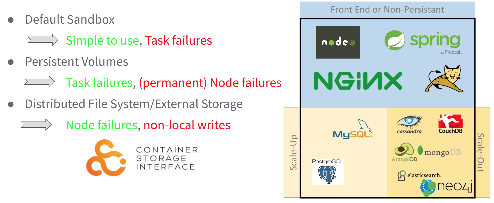

# Elasticsearch as a service on top of Apache Mesos and DC/OS

This is designed for a series of conference talks. You can find anything you need to know about DC/OS or this demo in this document or the outgoing links. This is a rather complex demo, so grab your favorit beer and enjoy 🍺


## Abstract
You are a bigger company and want to offer a self service solution for your employees to start and stop data stores on demand? Or are deploying highly dynamically applications and want the freedom to orchestrate your data services like Elasticsearch besides the rest of your architecture to profit from scaling effects? Especially talking about cluster resource utilization, various workloads or failures are challenges for the modern datacenter. To minimize these problems and maximize your cluster utilization, Apache Mesos and DC/OS, the datacenter operating system, helps you to operate huge clusters and operate your service architecture.
In this session we will see the motivation why big users operate Apache Mesos and how easy it is to implement a Elasticsearch as a service solution on top of it.


## General problems of current data center layouts
Current data center architectures are mostly static partitioned. Meaning, that you have different sub clusters for each part of your system. Let's say you have 30 nodes to host your system, then you would typically slice this 30 nodes into smaller parts and assign dedicated applications to dedicated nodes. This has a couple of disadvantages. You need to optimize each sub part of your cluster against load peaks and if nodes are crashing during those peaks, you are not able to shift dynamically applications to other nodes. On the other hand you are wasting a lot of resources.

If we look at resource utilization in typical industry clusters, we see an average CPU utilization around 15% with this classic approach. But would'nt it be cool to be able to shift applications dynamically between nodes, be more flexible against failure and load peaks and increase the utilization to save money?


In this demo we will see an increasing cluster utilization by operating the Java service architecture together with all data applications on the same DC/OS cluster.


## Operating data applications in a containerized world
Orchestrating stateless applications in a containerized world is fairly simple. If you need to scale up or down, you just start or stop applications. If an application terminates, you can just restart it somewhere else. But what about operating data applications, like a traditional database or a distributed one? I would bet that you care about your data and where a replacement application is started for example.

In general we do have three different kind of applications currently.



1. We have stateless applications, like `nginx`, `spring boot` or `node` applications. They usually don't hold business relevant data, so we usually don't care where replacement applications are scheduled or if we get the data back if an application crashes. For sure, this kind of applications is producing logs, but we will take care of those seperately. In Mesos it is possible to configure a default sandbox for those applications. You can use local disk, but if the container crashes, this data is gone.

2. We have statefull applications, traditional databases without cluster support, for example `MySQL`. They hold business relevant data and we usually care a lot what happens with this data if an application crashes. By the fact that those kind don't support replication on their own, the only chance to save our data are backups and external storage. If you really want to have a smooth fail-over strategy, you would usually pick an external storage option for those kind of tasks. This option has poor performance for write requests, but survives node failures. In Mesos it is possible to consume external storage, such as Amazon EBS.

3. But what if you are operating a database which was designed for distributed systems, like `Elasticsearch`, `Cassandra` or similar data stores? They hold business relevant data, but they are able to provide a replication layer within the database. Therefore it would be wasted performance if we would use a distributed storage layer, if our application is able to solve this problem. In Mesos it is possible to use local persistent volumes. With this feature it is possible to label a dedicated space on the local disk and if the application terminates, the replacement application can be re-scheduled to the exact same data again. It doesn't matter, if the application crashed because of an error, or if this was a planned maintenance or update. The already used data can be re-used and the application can decide if it wants to re-use the data and only replicate the last minutes or if a full replication is needed.


## Prerequisits
If you are totally new to [DC/OS](https://dcos.io/) or container orchestration in general, I would recommend you to visit our website and check the [documentation](https://dcos.io/docs/1.10/) section.

If you don't want to read documentation and a more entertaining (Monkey Island™) introduction, I am inviting you to watch this youbube video 👇❤️

[](https://www.youtube.com/watch?v=u2mpN2GxfVY)


## Please note
**Please don't consider this conference talk demo as production ready or use it in production.**

If you want to use a hosted elasticsearch, you may want to check out the more sophisticated scheduled elasticsearch installation using the [Mesosphere Elasticsearch scheduler](https://github.com/mesosphere/dcos-commons/tree/master/frameworks/elastic) or use the elasticsearch cloud offering.

[](https://www.elastic.co/cloud/as-a-service)


## Get this demo working on DC/OS
- You need a running DC/OS cluster to run this demo
- You have multiple options to spin up a DC/OS cluster
	- Go to https://dcos.io/ and to walk through the possibilities or browse the docs
	- Go to https://github.com/dcos/dcos-vagrant if you want to play around on your local box

Please check this page 👇
[](https://dcos.io/install/)


### 1. Install management application

Simply run the following command to deploy our management application on a running DC/OS cluster:

```
dcos marathon group add web-app/marathon-configuration.json
```

TBD